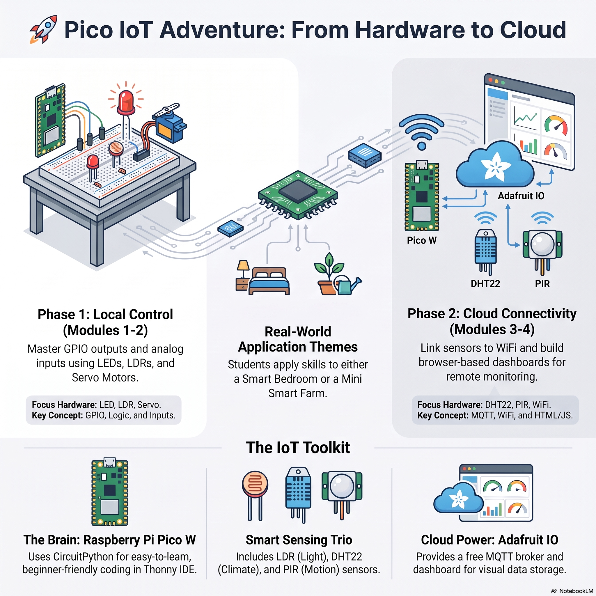

# 🚀 Pico IoT Adventure: Primary School Course

Welcome to the **Pico IoT Adventure** repository! This hands-on primary school course guides students through building a complete Internet of Things (IoT) system using the **Raspberry Pi Pico W**, **CircuitPython**, and a **Local Mosquitto MQTT Broker**.

Students bridge physical electronic hardware with modern browser-based web dashboards using lightweight, real-time network messages.

---

## 📺 Getting Started Video Tutorial

Need help getting your environment set up? Watch the official video guide below:

> 🎬 **[Click here to watch the step-by-step setup guide on YouTube](https://www.youtube.com/watch?v=56N_8FI_WLU)**

---

## 🌟 Learning Themes

Students can choose between two fun real-world applications to build throughout the course:

* 🛏️ **Theme 1: The Smart Bedroom**
  * Automated ambient nightlight
  * Motorized morning sun curtains
  * Intruder security alarm
* 🌾 **Theme 2: The Mini Smart Farm**
  * Automated greenhouse grow light
  * Smart sunshade deployer
  * Crop security & environment monitor

---

## 🛠️ Required Hardware List

| Category | Component | Quantity |
| :--- | :--- | :--- |
| **Brain** | Raspberry Pi Pico W | 1 |
| **Sensors** | LDR Light Sensor DHT22 Temp & Humidity Sensor PIR Motion Sensor | 1 of each |
| **Actuators** | LED + 220Ω Resistor SG90 Micro Servo Motor | 1 of each |
| **Accessories** | Breadboard, Jumper Wires, Micro-USB Cable, Cardboard Craft Materials | 1 set |

---

## 📂 Course Modules

This course is structured into 4 sequential modules. Click any module link below to access its guide and starter code:

| Module | Title | Hardware Covered | Key Concept |
| :--- | :--- | :--- | :--- |
| 🧠 **[Module 1](./Module-1-Hello-Brain)** | **Hello Brain!** | LED | Basic GPIO Outputs & Timing Loops |
| ☀️ **[Module 2](./Module-2-Sensing-The-World)** | **Sensing the World** | LDR, Servo Motor | Analog Inputs & Threshold Logic |
| 🛰️ **[Module 3](./Module-3-Going-Online)** | **Going Online** | DHT22, PIR Sensor, Wi-Fi | Local MQTT Publishing & Network Telemetry |
| 💻 **[Module 4](./Module-4-The-Website)** | **The Control Center** | HTML, Web Browser | Data Visualization & Web Remote Control |

---

## 🧰 Software Requirements

1. **[Thonny IDE](https://thonny.org/):** Code editor used to run CircuitPython scripts.
2. **[CircuitPython UF2](https://circuitpython.org/board/raspberry_pi_pico_w/):** Firmware flashed onto the Raspberry Pi Pico W.
3. **[Mosquitto MQTT Broker](https://mosquitto.org/):** Local server running on the teacher PC (no registration needed!).

---

## 🚀 Quick Setup Instructions

> [!TIP]
> **Before Starting:** Make sure your Teacher PC is running Mosquitto MQTT with WebSockets enabled on Port `9001`!

1. Clone or download this repository to your computer.
2. Open **Thonny IDE** and select interpreter: **CircuitPython (Generic)**.
3. Plug in your Raspberry Pi Pico W via Micro-USB.
4. Watch the [Getting Started Video](https://www.youtube.com/watch?v=56N_8FI_WLU) and start with **[Module 1](./Module-1-Hello-Brain)**!
