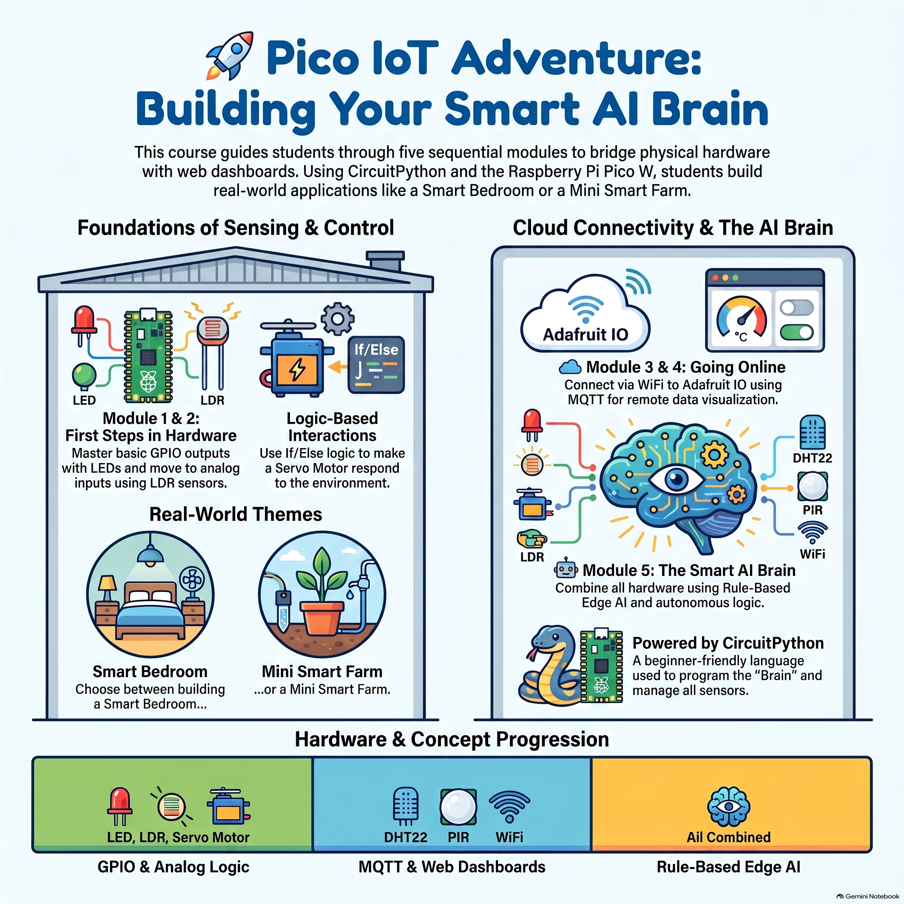

# 🚀 Pico IoT Adventure

Welcome to the **Pico IoT Adventure** repository! Designed as an **Intro to Maker Tech**, this hands-on course guides learners through building a complete Internet of Things (IoT) system using the **Raspberry Pi Pico W**, **CircuitPython**, and the **Adafruit IO Cloud Service**.

Students will learn to bridge physical electronic hardware with modern browser-based web dashboards using **Adafruit IO** and real-time **MQTT** messaging.

---

## 📺 Getting Started Video Tutorial

Need help setting up your workspace? Watch the step-by-step video guide below:

> 🎬 **[Click here to watch the setup guide on YouTube](https://www.youtube.com/watch?v=56N_8FI_WLU)**

---

## 🌟 Learning Themes

Students can choose between two fun real-world applications to build throughout the course:

* 🛏️ **Theme 1: The Smart Bedroom**
  * Automated ambient nightlight
  * Motorized morning sun curtains
  * Intruder security alarm
* 🌾 **Theme 2: The Mini Smart Farm**
  * Automated greenhouse grow light
  * Smart sunshade deployer
  * Crop security & environment monitor

---

## 🛠️ Required Hardware List

| Category | Component | Quantity |
| :--- | :--- | :--- |
| **Brain** | Raspberry Pi Pico W | 1 |
| **Sensors** | LDR Light Sensor DHT22 Temp & Humidity Sensor PIR Motion Sensor | 1 of each |
| **Actuators** | LED + 220Ω Resistor SG90 Micro Servo Motor | 1 of each |
| **Accessories** | Breadboard, Jumper Wires, Micro-USB Cable, Craft Materials | 1 set |

---

## 📂 Course Modules

This course is structured into **5 sequential modules**. Click any module link below to access its step-by-step guide and starter code:

| Module | Title | Hardware Covered | Key Concept |
| :--- | :--- | :--- | :--- |
| 🧠 **[Module 1](./Module-1-Hello-Brain)** | **Hello Brain!** | LED | Basic GPIO Outputs & Timing Loops |
| ☀️ **[Module 2](./Module-2-Sensing-The-World)** | **Sensing the World** | LDR, Servo Motor | Analog Inputs & Threshold Logic |
| 🛰️ **[Module 3](./Module-3-Going-Online)** | **Going Online** | DHT22, PIR Sensor, Wi-Fi | MQTT Publishing & Adafruit IO Cloud |
| 💻 **[Module 4](./Module-4-The-Website)** | **The Control Center** | HTML, Web Browser | Data Visualization & Web Remote Control |
| 🤖 **[Module 5](./Module-5-The-Smart-AI-Brain)**| **The Smart AI Brain** | All Hardware combined | Rule-Based Edge AI & Autonomous Logic |

---

## 🧰 Software Requirements

1. **[Thonny IDE](https://thonny.org/):** Beginner-friendly Python editor used to run code on the Pico W.
2. **[CircuitPython UF2](https://circuitpython.org/board/raspberry_pi_pico_w/):** Firmware installed on the Raspberry Pi Pico W.
3. **[Adafruit IO Account](https://io.adafruit.com/):** Free MQTT cloud service for storing and visualizing sensor data.

### 📚 Required CircuitPython Libraries
To make all the sensors and cloud features work properly, you must download the **[CircuitPython Library Bundle](https://circuitpython.org/libraries)**. Make sure to download the version that matches your installed CircuitPython (e.g., 9.x or 10.x).

Extract the `.zip` file you downloaded and copy the following files/folders directly into the **`lib`** folder on your **`CIRCUITPY`** drive:

* ⚙️ **`adafruit_motor`** (Folder) - Controls the servo motor.
* 🌡️ **`adafruit_dht`** (Folder or `.mpy`) - Reads the temperature and humidity sensor.
* 📡 **`adafruit_minimqtt`** (Folder) - The core engine that sends messages to the cloud.
* ☁️ **`adafruit_io`** (Folder) - Connects specifically to Adafruit IO dashboards.
* 🔌 **`adafruit_connection_manager.mpy`** (File) - *Required helper for Wi-Fi sockets.*
* ⏱️ **`adafruit_ticks.mpy`** (File) - *Required helper for timing tasks without freezing.*

> [!WARNING]
> **Important:** If you miss `adafruit_connection_manager.mpy` or `adafruit_ticks.mpy`, your code will crash when trying to connect to the internet!

---

## 🚀 Quick Setup Instructions

> [!TIP]
> **Before Starting:** Make sure you have created a free account on [Adafruit IO](https://io.adafruit.com/) and noted down your **Username** and **AIO Key**!

1. Clone or download this repository to your computer.
2. Open **Thonny IDE** and select the interpreter: **CircuitPython (Generic)**.
3. Plug in your Raspberry Pi Pico W via Micro-USB and upload the required libraries to the `lib` folder.
4. Watch the [Getting Started Video](https://www.youtube.com/watch?v=56N_8FI_WLU) and dive into **[Module 1](./Module-1-Hello-Brain)**!
